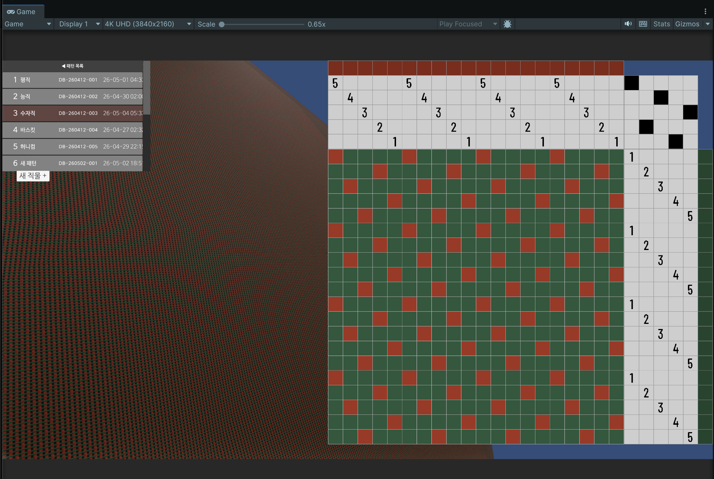

# WeaveForge

직조 구조 설계부터 PBR 텍스처 렌더링까지 이어주는 Unity 기반 직물 시뮬레이터

> 기존 직기 소프트웨어(WeavePoint, Fiberworks 등)는 조직도 설계만 가능합니다.  
> WeaveForge는 그 조직도가 실제 직물 표면에서 어떻게 보이는지를 실시간으로 렌더링합니다.

---

## 스크린샷

**조직도 편집 → 실시간 렌더링**


*타이업/통경/트레들링 편집 및 드로다운 자동 계산*


*2/2 능직 Drawdown 모드 렌더링 — 실의 굴곡과 교차 구조 표현*

---

## 주요 기능

**조직도 편집**
- 타이업(Tieup) / 통경(Threading) / 트레들링(Treadling) 편집
- 드로다운(Drawdown) 자동 계산
- 타이업 드래그 페인팅
- 경사/위사 컬러 설정

**물리 기반 밀도 설정**
- EPI / PPI (인치당 실 수) 입력
- 번수(Yarn Count) 기반 실 직경 자동 계산 (Peirce 공식)
- Coverage(실 점유율) 자동 계산

**PBR 텍스처 자동 생성**
- Diffuse / Normal / Roughness / MetallicGloss 텍스처
- CellBased 모드: 셀 단위 빠른 렌더링
- Drawdown 모드: 실의 연속성을 표현한 고품질 렌더링
  - 경사/위사가 서로를 넘고 파묻히는 굴곡 표현
  - 코사인 보간으로 부드러운 경계 전환

**패턴 저장/관리**
- SQLite 기반 패턴 DB (첫 실행 시 자동 생성)
- 패턴 목록 / 저장 / 불러오기 / 이름 변경 / 삭제

---

## 기술 스택

| 항목 | 내용 |
|------|------|
| 엔진 | Unity 6 (URP) |
| 렌더링 | Shader Graph, PBR |
| DB | SQLite |
| UI | Odin Inspector |
| 언어 | C# |

---

## 시작하기

### 요구사항
- Unity 6 이상
- Universal Render Pipeline (URP)
- [Odin Inspector](https://odininspector.com/) (유료 에셋)

### 실행 방법

```bash
git clone https://github.com/ilkwon/WeaveForge.git
```

1. Unity Hub에서 프로젝트 열기
2. `WeaveEditorScene` 씬 실행
3. DB는 첫 실행 시 자동 생성됩니다

---

## 개발 현황

**입력 파트**

| 항목 | 상태 |
|------|------|
| 타이업 셀 토글 / 드래그 페인팅 | ✅ |
| 4분할 레이아웃 | ✅ |
| 드로다운 자동 계산 | ✅ |
| 경사/위사 컬러피커 | ✅ |
| 밀도 설정 (EPI/PPI) | ✅ |
| 스크롤바 / 줌인아웃 | 🔜 |

**렌더링 파트**

| 항목 | 상태 |
|------|------|
| CellBased 텍스처 생성 | ✅ |
| Drawdown 텍스처 생성 | ✅ |
| Diffuse / Normal / Roughness 구체 렌더링 | ✅ |
| MetallicGloss 연결 | 🔜 |
| 모드 전환 UI | 🔜 |

**데이터**

| 항목 | 상태 |
|------|------|
| SQLite 저장/불러오기 | ✅ |
| 설정값 저장 | 🔜 |
| 스크롤바 | 🔜 |

---

## 로드맵

```
단기
  → 스크롤바 + 줌인아웃
  → 설정값 저장

중기
  → 모드 전환 UI (조직도 / 2D 컬러 / 높이맵 / PBR)
  → WIF 파일 임포트/익스포트

장기
  → 미정.
```

---

## 라이선스

이 프로젝트는 [CC BY-NC 4.0](https://creativecommons.org/licenses/by-nc/4.0/) 라이선스를 따릅니다.

- 출처 표시 조건으로 자유롭게 사용, 수정, 배포 가능합니다
- **상업적 용도로의 사용은 금지됩니다**
- 상업적 이용 문의: *(연락처 추가 예정)*
